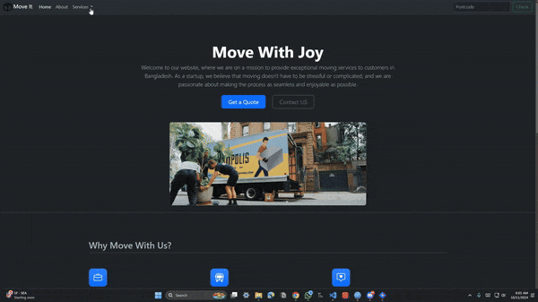

# Move It - Moving Service Website

**Move It** is a user-friendly website designed to assist people in finding and arranging professional moving services. The site uses modern Bootstrap components to provide a clean and responsive experience for users looking to relocate, ensuring a smooth and stress-free move.

## Table of Contents
- [Demo](#demo)
- [Technologies Used](#technologies-used)
- [Features](#features)
- [Getting Started](#getting-started)
- [Installation](#installation)
- [Usage](#usage)
- [Contributing](#contributing)


## Demo
You can view a live demo of the project [here](https://shafayat666.github.io/bootstrap-moveit/).  


## Technologies Used
- HTML5
- CSS3
- Bootstrap 5
- JavaScript

## Features
- Responsive layout with Bootstrap's grid system
- Carousel for testimonials and success stories
- Interactive buttons 
- Services section highlighting key features

## Getting Started
To get started with this project, you can clone the repository and open the `index.html` file in your browser.

### Prerequisites
- Web browser (e.g., Chrome, Firefox)
- Internet connection for loading Bootstrap assets

## Installation
1. Clone the repository:
    ```bash
    git clone https://github.com/shafayat666/bootstrap-moveit.git
    ```
2. Open the `index.html` file in your preferred web browser.

## Usage
1. Navigate through the services offered.
2. Use the interactive buttons to get a moving quote or contact customer service.
3. Browse through the testimonials in the carousel to learn more about the services.

## Contributing
If you want to contribute to this project, please fork the repository and submit a pull request.
